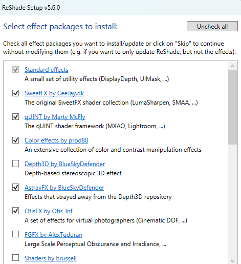
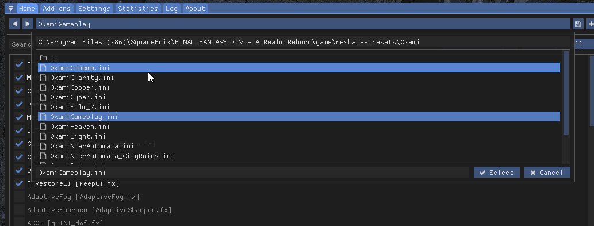

# YomigamiOkami ReShade 5.6.0 port

This repository contains a port for most of [Yomigami Okami](https://twitter.com/Yomigammy)'s presets from GShade to vanilla ReShade 5.6.0.

The presets have been validated and approved by Yomigami Okami, and the port was made by [Meynan](https://twitter.com/meynan_ffxiv).

The presets are not expected to work with any other setups than a pure vanilla ReShade.
If you applied former GShade files to replace the ones installed through the ReShade installer, they may not work with the expected graphical output, or not work at all.

## Notes on copyrighted content and this repository

This port as been made with only freely redistributable materials from GShade.
That means some shaders or textures could not be used or included and as such these presets may differ from their GShade original counterpart.

While this repository and the content created by and for Yomigami Okami is under MIT License, please note that shaders in the ``reshade-shaders/Shaders` folder may have their own licensing keeping your from modifying them. 

Nonetheless, as stated just above, every content in this repository may be freely redistributed as is.

## Installation steps

### Install ReShade 5.6.0

* Go to the official ReShade website and download the installer [https://reshade.me/#download](https://reshade.me/#download)

    The add-ons support is not required for these presets to work.

* Follow the installer steps until you reach the package selection window
* Check the following packages to have a ReShade setup with the required shaders to have the Okami presets work
    * Standard effects
    * SweetFX by CeeJay.dk
    * qUINT by Marty McFly
    * Color effects by prod80
    * AstrayFX by BlueSkyDefender
    * OtifFX by Otis Inf

That's it, the first step to get ReShade working is complete.

### Setting up ReShade to behave more like GShade (optional)

Here are a few settings you can change to have ReShade behave a bit more like GShade.

* __Overlay key__: change it from `Home` to anything you had in GShade, like `Shift + F2`
* __Effect key__: set it to whatever key you fancy, like `Shift + F3`
* __Input processing__: in that dropdown menu, select `Block input when cursor is on overlay`
* __Effect search path__: either add manually all shaders subfolders (including the Okami one you'll be installing) or remove all but one and use the following syntax to take every subfolder into account `.\reshade-shaders\Shaders\**`
* __Texture search path__: change the path to be `.\reshade-shaders\Textures\**`

### Install Okami presets' files

* Take the content of the `reshade-shaders` folder and fuse it with your game installation of ReShade.
* You should now have a `Okami` subfolder in your `reshade-shaders\Shaders` folder, and a `reshade-shaders\Textures`

* Do the same with the `reshade-presets` folder and fust it in your game installation of ReShade.

### Launch the game

Once the game is launched and the shaders compiled, provided there were no compilation errors you should have the Okami presets available.

> **Enjoy your time in /gpose, and don't hesitate to create your very own set of presets!**

## Support

No support will be provided for these presets. The licensing permit everyone and anyone to just adapt the presets to their need and specific ReShade setup, as many different flavours are already out there in the wild.

See the next section for common issues that may arise and can be easily fixed.

## Troubleshooting

* I can see multiple times the same shader enabled for the preset

    > This probably means you already have said shader file somewhere else in your installation. One of the most common occurence of this issue would be the `KeepUI.fx` file coming from GShade.
    > To solve this, simply choose which one you want to keep and rename or delete the other one.

* Other GShade presets don't work with this port

    > As it is a port made and tested solely for the YomigamiOkami presets, and based on a purely clean and vanilla installation of ReShade, it may lack other GShade shaders that other presets rely upon.

* I'm working on a custom ReShade installer/a script to distribute presets for FFXVI, can I include these in my packaging?

    > Yes as it is MIT Licensed, you may do so.
    > Remember to include said license and with the presets though.

## Note

You can commission and see Yomigami Okami's art here: [https://yomiartcommissions.carrd.co/](https://yomiartcommissions.carrd.co/)

