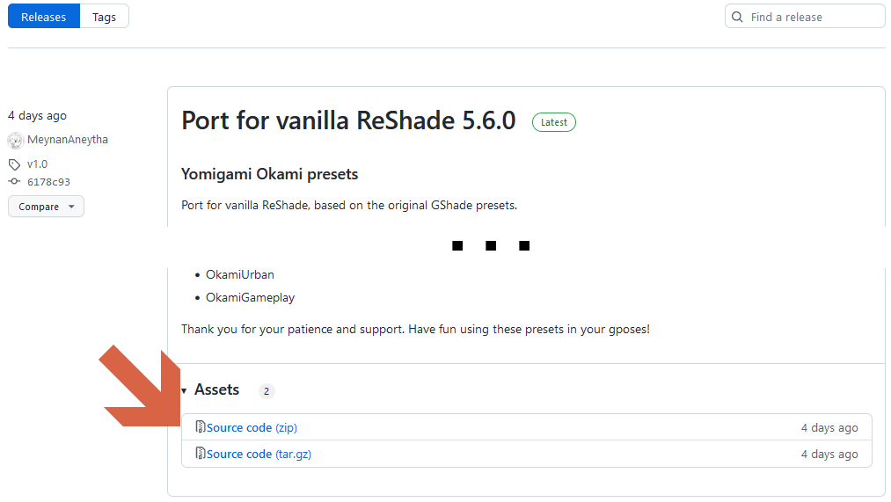

# YomigamiOkami gshade presets

This branch/repository contains presets for GShade 4.x, made and approved by [Yomigami Okami](https://twitter.com/Yomigammy).

The ReShade port can be found [here](https://github.com/MeynanAneytha/YomigamiOkami-reshade-shaders/tree/main).

## Content & Preview

Presets in this repository are updated versions of the existing GShade presets you might have known. These updated versions could not make their way into GShade upgrades in time and are presented here as a standalone package.

The _Multilut_ texture file required by GShade installations to provide Yomigami's LUT effects is included.

Also included: the **exclusive** new preset `OkamiCopper.ini`.

The presets included in this port are showcased here.

## Download steps

To download the presets prior to the installation phase, you can go to the [Releases section of this repository](https://github.com/MeynanAneytha/YomigamiOkami-reshade-shaders/releases),
pick the latest version and download the file named `Source code (zip)` under the _Assets_ menu.

## Installation steps

If you have an older GShade setup, copy the `gshade-presets` and `gshade-shaders` over their respective original locations and merge their content.

And voilà! The presets should work as intended.

If you have any other kind of custom installation based on ReShade (forked or not), you will have to copy the presets where necessary and to adjust them for whatever shaders you have at your disposal.

**Note**: this repository only provides presets, based on the assumptions the required shaders are already present on your system.

## Support

No support will be provided for these presets.

## Note

You can commission and see Yomigami Okami's art here: [https://yomiartcommissions.carrd.co/](https://yomiartcommissions.carrd.co/)
